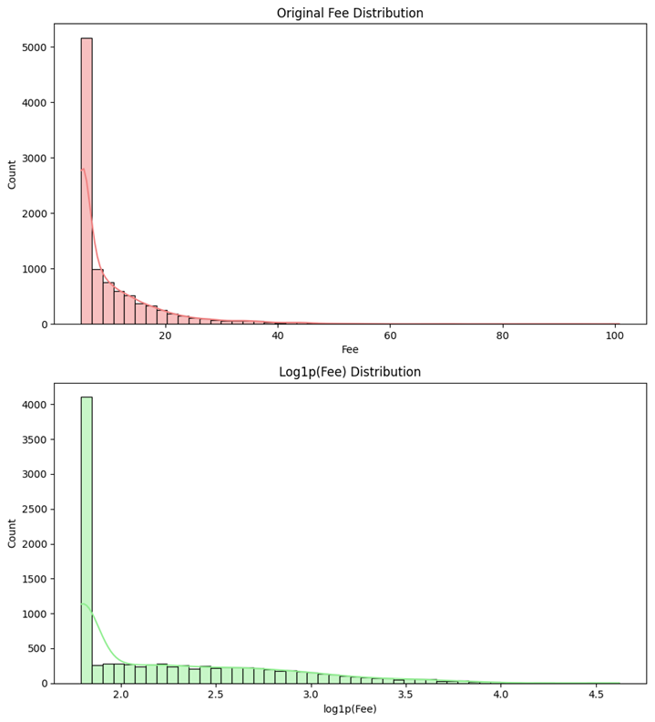
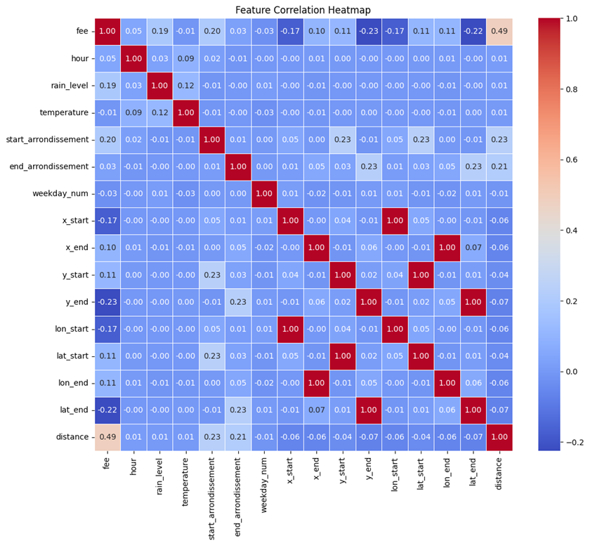
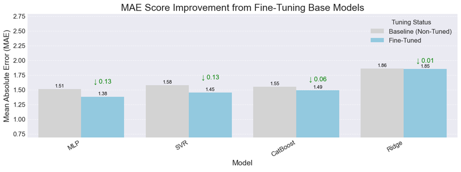
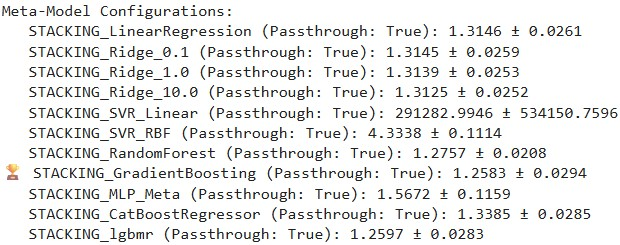
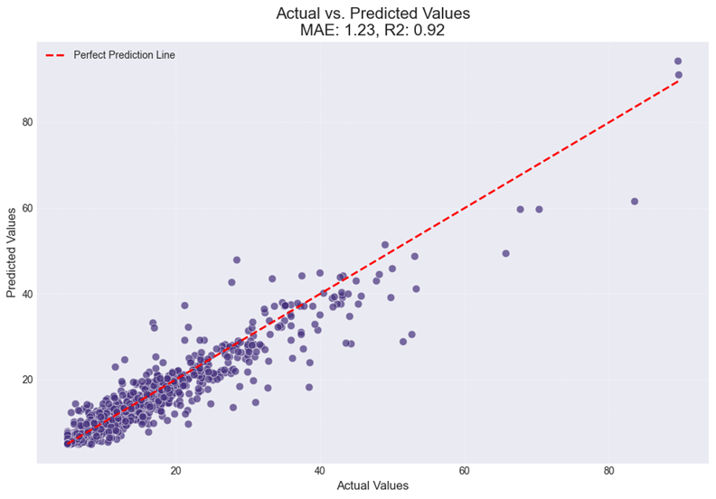

# Uber Ride Pricing Analysis - January 2023, Paris

This repository contains a Jupyter Notebook detailing an in-depth analysis of Uber's ride pricing algorithm based on historical trip data from Paris during January 2023.  

This project originated as a **Data Science homework assignment given by a company in Paris**. I did not end up joining them but i kept the exercice as it provides a good opportunity to practice and apply various data science methodologies. The goal was to explore the provided dataset, build robust predictive models for ride fares, evaluate their performance, and critically analyze the factors influencing pricing, including potential biases or unutilized variables within the data.

**Exercice statement**

*As a newly recruited data scientist member of the XXX team at our XXX company, your first mission is to identify any potential biases in the pricing algorithm of our ride-hailing platform.*  
*- You will begin by exploring the dataset and generating the visualizations that you deem relevant.*  
*- You will then attempt to model the ride fares using the model(s) of your choice. You will evaluate the quality of your model(s) and produce a critical analysis of the results.*  
*- If time permits, you may attempt to answer the following question: Is it possible to identify any biases in the dataset or to determine which variables, among those at your disposal, are not being utilized by our algorithm in its ride fare calculation?*  

## Project Overview

I was provided with a CSV file containing the historical record of **10,000 rides** completed in Paris throughout January 2023. Each entry includes three core variables: `timestamp` (the time of the ride request), `raw_start_location` (the pickup address), and `raw_end_location` (the destination address).

### Key Stages & Summary of Findings

#### 1. Exploratory Data Analysis (EDA)
This phase involved understanding the raw dataset's structure, identifying data types, and performing basic data cleaning. A key finding was the highly skewed distribution of the target variable (`fee`), which was addressed by applying a `np.log1p` transformation to mitigate the impact of outliers and normalize the distribution.



#### 2. Feature Engineering & Exploration
Extensive feature engineering was performed on the raw timestamp and location data. This included parsing timestamps to extract temporal features, geocoding addresses for precise coordinates, and calculating trip distances. The analysis of these features revealed strong correlations between ride fares and temporal patterns (e.g., **`hour`**, day of the week), geographical locations, and trip **`distance`**. We also integrated external hourly **weather data** for Paris, though initial correlation analysis indicated it had **low importance** for predicting fares.



#### 3. Model Selection & Individual Fine-Tuning
We selected four diverse models to serve as base learners for our ensemble, each chosen for its unique strengths:
* **PolynomialFeatures + Ridge:** A linear model for its ability to capture explicit non-linearities.
* **SVR with RBF Kernel:** A non-linear model for its robust handling of complex relationships.
* **CatBoostRegressor:** A powerful tree-based model for its strong generalization and categorical feature handling.
* **PolynomialFeatures + MLPRegressor:** A neural network for its flexibility in approximating complex functions.



Each of these models was individually fine-tuned using a combination of **Grid Search** and efficient **Bayesian Optimization** to achieve their maximum performance, with the best cross-validated MAE ranging from **1.3804** (for the MLP) to **1.8506** (for the Ridge model).

#### 4. Stacking Ensemble & Meta-Model Fine-Tuning
A **stacking ensemble** approach was implemented to combine the strengths of the fine-tuned base models. After cross-validation, it was found that the ensemble performed best when using a **`GradientBoostingRegressor`** as its meta-learner and operating on a stack of only three base models (**SVR**, **MLP**, and **CatBoost**). The meta-learner was then fine-tuned using Bayesian Optimization.



#### 5. Final Model Evaluation & Conclusion
The fully-trained meta-model was evaluated on a completely unseen test set. It achieved a final MAE of **1.2306**, demonstrating its ability to generalize well to new data without overfitting. The high $R^2$ of **0.92** confirmed the model's strong predictive power.
The residual analysis showed the model's predictions are highly accurate for smaller fares, with minimal bias (residual mean of **0.27**). However, a pattern of **heteroscedasticity** was observed, with prediction errors increasing for higher fare values.



### Data Sources

To support this analysis, the following supplementary datasets have been provided:

* **Météo-France Weather Data:** Historical temperature and rain levels for Paris during January 2023, recorded on an hourly basis. The `rain_level` column categorizes precipitation from 0 (no rain) to 3 (heavy rain).
* **National Address Database (Base Adresse Nationale) for Paris:** Accessible at [https://adresse.data.gouv.fr/data/ban/adresses/latest/csv/adresses-75.csv.gz](https://adresse.data.gouv.fr/data/ban/adresses/latest/csv/adresses-75.csv.gz). This comprehensive database provides essential geographical information for Parisian addresses, crucial for enriching our raw location data.

**Note on Address Format:** Addresses in the primary Uber dataset are formatted as `[number][suffix], [street name], [city name]` (e.g., `[rep]` corresponds to suffixes like "bis", "ter", etc., for building numbers). Careful parsing and geocoding was required to effectively integrate this information.

## ⚙️ Repository Contents and Installation

* `uber_pricing_analysis.ipynb`: The main Jupyter Notebook containing all the code for data loading, preprocessing, EDA, model training, evaluation, and feature importance analysis.
* `requirements.txt`: A file listing all the Python dependencies required to run the Jupyter Notebook successfully.

To get this project up and running on your local machine, follow these simple steps:

1.  **Clone the repository:**
    ```bash
    git clone [https://github.com/nabilalibou/Uber_Fare_Prediction_Explained.git](https://github.com/nabilalibou/Uber_Fare_Prediction_Explained.git)
    ```
2.  **Navigate to the project directory:**
    ```bash
    cd Uber_Fare_Prediction_Explained
    ```
3.  **Install the required Python dependencies:**
    ```bash
    pip install -r requirements.txt
    ```
4.  **Launch Jupyter Notebook and open `uber_pricing_analysis.ipynb`:**
    ```bash
    jupyter notebook
    ```